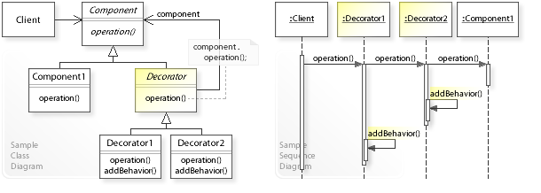

# Intent

객체에 책임을 동적으로 추가할 수 있다. 데코레이터는 기능 확장을 위해 서브클래싱에 대한 유연한 대안을 제공한다.

데코레이터 디자인 패턴은 다음과 같은 문제를 해결한다:

- 객체에 어떻게 책임을 동적으로 추가할 수 있는가?
- 런타임에 객체의 기능을 어떻게 확장할 수 있는가?

# Problem

서브클래싱은 컴파일 타임에 정적으로 클래스의 기능을 확장(책임 추가)하는 표준 방법이다.
서브클래스 인스턴스화되면 해당 기능은 인스턴스의 수명 기간 동안 인스턴스에 바인딩되며 런타임에 변경할 수 없다.
컴파일 타임에 클래스의 기능을 확장하는 대신 런타임에 객체의 기능을 확장하려는 경우 이러한 접근 방식은 피해야 한다.

# Solution

객체에 책임을 추가하는 별도의 데코레이터 객체를 정의하여, 데코레이터 객체를 통해 런타임에 객체의 기능을 확장할 수 있다.

